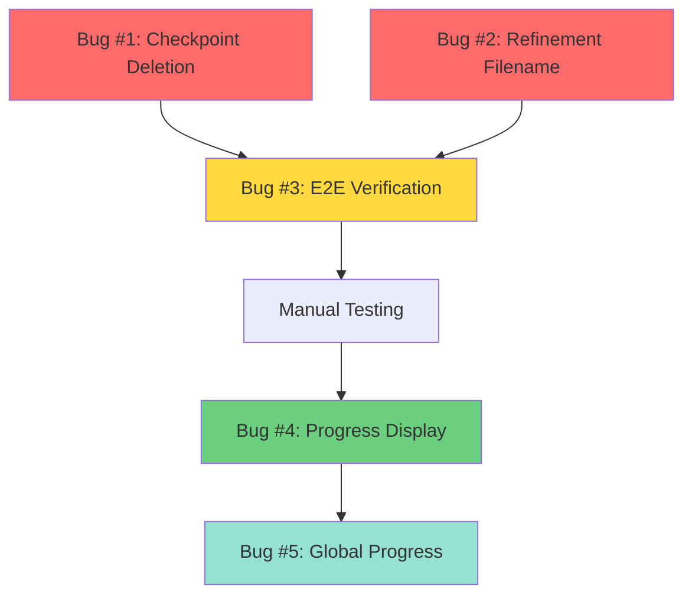

# HumanifyJS Critical Bug Fix Plan
**Date**: 2025-11-17 12:00:00
**Planner**: Implementation Planner Agent
**Source STATUS**: STATUS-2025-11-17-010000.md
**Spec Version**: CLAUDE.md (last modified 2025-11-16)

---

## Executive Summary

Based on deep code analysis from STATUS-2025-11-17-010000.md, this plan addresses **5 CRITICAL BUGS** that prevent HumanifyJS from being production-ready:

**Priority 1 (Data Loss Prevention - 3.5 hours)**:
- Bug #1: Checkpoint deletion happens before file write (30 min)
- Bug #2: Refinement uses hardcoded wrong filename (2 hours)
- Bug #3: Add E2E verification test (4 hours → moved to P1 as confidence builder)

**Priority 2 (User Experience - 4 hours)**:
- Bug #4: Multiple overlapping progress bars (4 hours)

**Priority 3 (Future Enhancement - 8 hours)**:
- Bug #5: No global progress tracking (8 hours)

**Total Critical Path**: 7.5 hours to production-ready
**Total with UX fixes**: 11.5 hours
**Total with enhancements**: 19.5 hours

---

## Bug #1: Checkpoint Deletion Timing

### Status Reference
**STATUS-2025-11-17-010000.md**: Lines 27-73 (Critical Bug #1)

### Problem
Checkpoint is deleted in `visit-all-identifiers.ts:152` BEFORE:
- Prettier plugin runs (could fail)
- File is written to disk (could fail)
- Any downstream processing completes

**Data Flow**:
```
visitAllIdentifiers() [line 155]
  ↓ returns code
  ↓ [CHECKPOINT DELETED HERE ❌]
openaiRename() [line 187]
  ↓ returns code
prettier plugin [openai.ts:237]
  ↓ (could fail)
fs.writeFile() [unminify.ts:262]
  ↓ (could fail)
```

**Impact**: If ANY step fails after checkpoint deletion, ALL PROGRESS IS LOST. This defeats the entire purpose of checkpoints.

### Solution Design

**Phase 1: Return checkpoint ID instead of deleting**

File: `src/plugins/local-llm-rename/visit-all-identifiers.ts`

Current (lines 150-156):
```typescript
rootSpan.setAttribute("outputSize", stringified.code.length);

// Delete checkpoint on successful completion
if (originalCheckpointId) {
  deleteCheckpoint(originalCheckpointId);  // ❌ TOO EARLY
}

return stringified.code;
```

New:
```typescript
rootSpan.setAttribute("outputSize", stringified.code.length);

// Return both code and checkpoint ID so caller can delete after file write
return {
  code: stringified.code,
  checkpointId: originalCheckpointId
};
```

**Phase 2: Update function signature**

Change return type from `Promise<string>` to:
```typescript
Promise<{ code: string; checkpointId: string | null }>
```

**Phase 3: Update all callers**

Files to update:
1. `src/plugins/openai/openai-rename.ts` - Call site of visitAllIdentifiers
2. `src/plugins/gemini-rename.ts` - Call site of visitAllIdentifiers
3. `src/plugins/local-llm-rename/local-llm-rename.ts` - Call site of visitAllIdentifiers

Each needs to:
```typescript
// Before
const renamedCode = await visitAllIdentifiers(code, visitor, options);

// After
const result = await visitAllIdentifiers(code, visitor, options);
const renamedCode = result.code;
return { code: renamedCode, checkpointId: result.checkpointId };
```

**Phase 4: Update plugin interface**

Change plugin interface from `(code: string) => Promise<string>` to:
```typescript
type RenamePlugin = (code: string) => Promise<{
  code: string;
  checkpointId?: string | null;
}>;
```

**Phase 5: Delete checkpoint in unminify.ts**

File: `src/unminify.ts`

Current (lines 195-263):
```typescript
for (let j = 0; j < plugins.length; j++) {
  currentCode = await plugins[j](currentCode);
}

console.log(`[3/3] Writing output to ${file.path}`);
await fs.writeFile(file.path, currentCode);
```

New (lines 195-270):
```typescript
let checkpointToDelete: string | null = null;

for (let j = 0; j < plugins.length; j++) {
  const result = await plugins[j](currentCode);

  // Handle both old-style (string) and new-style (object) returns
  if (typeof result === 'string') {
    currentCode = result;
  } else {
    currentCode = result.code;
    if (result.checkpointId) {
      checkpointToDelete = result.checkpointId;
    }
  }
}

console.log(`[3/3] Writing output to ${file.path}`);
await fs.writeFile(file.path, currentCode);

// Delete checkpoint ONLY after successful file write
if (checkpointToDelete) {
  console.log(`🗑️  Cleaning up checkpoint ${checkpointToDelete}`);
  deleteCheckpoint(checkpointToDelete);
}
```

### Acceptance Criteria
- [ ] visitAllIdentifiers returns `{ code, checkpointId }` not just `code`
- [ ] All three rename plugins updated (openai, gemini, local)
- [ ] unminify.ts deletes checkpoint AFTER fs.writeFile succeeds
- [ ] If file write fails, checkpoint remains for recovery
- [ ] Existing checkpoint tests still pass
- [ ] New test: checkpoint persists if write fails

### Testing Strategy
1. **Unit test**: Mock fs.writeFile to fail, verify checkpoint NOT deleted
2. **E2E test**: Process file, kill process after AST transform but before write, verify checkpoint exists and can resume
3. **Regression test**: All existing checkpoint tests pass

### Estimated Effort
**30 minutes** (straightforward refactor)

### File Changes
- `src/plugins/local-llm-rename/visit-all-identifiers.ts` (lines 150-156)
- `src/plugins/openai/openai-rename.ts` (update caller)
- `src/plugins/gemini-rename.ts` (update caller)
- `src/plugins/local-llm-rename/local-llm-rename.ts` (update caller)
- `src/unminify.ts` (lines 195-270, add deletion after write)
- `src/checkpoint.ts` (import deleteCheckpoint if needed)

---

## Bug #2: Refinement Filename Hardcoded

### Status Reference
**STATUS-2025-11-17-010000.md**: Lines 76-123 (Critical Bug #2)

### Problem
Refinement pass assumes output file is `deobfuscated.js` (line 249 of openai.ts), but:

**Reality**:
- Webcrack extracts bundles to files like `bundle_1.js`, `index.js`, `utils.js`
- NOT `deobfuscated.js`

**What Happens**:
1. Pass 1 writes to `output/bundle_1.js`, `output/bundle_2.js`, etc.
2. Pass 2 tries to read `output/deobfuscated.js` which **DOESN'T EXIST**
3. unminify() throws error or creates empty file
4. Refinement never happens

**Evidence**:
```typescript
// openai.ts:248-249 - WRONG ASSUMPTION
const pass1OutputFile = `${opts.outputDir}/deobfuscated.js`;
await unminify(pass1OutputFile, opts.outputDir, [...plugins]);
```

vs.

```typescript
// webcrack.ts:46-49 - ACTUAL FILE NAMING
const output = await fs.readdir(outputDir);
const files = output
  .filter((file) => file.endsWith(".js"))
  .map((file) => ({ path: path.join(outputDir, file) }));
```

### Solution Design

**Phase 1: Get actual output files**

File: `src/commands/openai.ts` (lines 244-276)

Current:
```typescript
if (opts.refine) {
  console.log("\n=== Pass 2: Refinement (2x parallelism) ===\n");

  const pass1OutputFile = `${opts.outputDir}/deobfuscated.js`;  // ❌ WRONG

  await unminify(pass1OutputFile, opts.outputDir, [
    babel,
    openaiRename({ /* ... */ }),
    prettier
  ], { /* ... */ });
}
```

New:
```typescript
if (opts.refine) {
  console.log("\n=== Pass 2: Refinement (2x parallelism) ===\n");

  // Get ACTUAL files written by pass 1
  const outputContents = await fs.readdir(opts.outputDir);
  const pass1Files = outputContents
    .filter(file => file.endsWith('.js'))
    .map(file => path.join(opts.outputDir, file));

  if (pass1Files.length === 0) {
    console.warn("⚠️  No JavaScript files found for refinement");
    return;
  }

  console.log(`📂 Refining ${pass1Files.length} file(s)...`);

  // Process EACH file from pass 1
  for (const file of pass1Files) {
    console.log(`\n  Refining: ${path.basename(file)}`);

    await unminify(file, opts.outputDir, [
      babel,
      openaiRename({
        model: opts.model,
        maxConcurrent: opts.maxConcurrent * 2,  // 2x parallelism
        contextWindowSize: opts.contextSize,
        turboMode: opts.turbo,
        checkpointId: null,  // No checkpoints for refinement pass
      }),
      prettier
    ], {
      turboMode: opts.turbo,
      minBatchSize: opts.minBatchSize,
      maxBatchSize: opts.maxBatchSize,
      dependencyMode: opts.dependencyMode,
    });
  }

  console.log("\n✓ Refinement complete");
}
```

**Phase 2: Prevent recursive webcrack**

Issue: If we pass output files back to unminify(), webcrack will run AGAIN and might re-bundle.

Solution: Add flag to unminify() to skip webcrack:

File: `src/unminify.ts`

Add parameter:
```typescript
export async function unminify(
  inputPath: string,
  outputDir: string,
  plugins: ((code: string) => Promise<string>)[],
  options?: {
    turboMode?: boolean;
    minBatchSize?: number;
    maxBatchSize?: number;
    dependencyMode?: DependencyMode;
    skipWebcrack?: boolean;  // NEW
  }
): Promise<void>
```

Update webcrack call (line 88):
```typescript
// Run webcrack to unbundle if not skipped
const files = options?.skipWebcrack
  ? [{ path: inputPath }]
  : await webcrack(inputPath, outputDir);
```

**Phase 3: Apply same fix to gemini.ts and local.ts**

Files to update:
- `src/commands/gemini.ts` - Has same refinement code
- `src/commands/local.ts` - Check if it has --refine flag

### Acceptance Criteria
- [ ] Refinement reads actual files from output directory
- [ ] Each file from pass 1 is processed separately in pass 2
- [ ] No hardcoded filename assumptions
- [ ] Works with single file (no webcrack split)
- [ ] Works with multiple files (webcrack split)
- [ ] Webcrack does NOT run again on already-processed files
- [ ] New E2E test: Bundle with 3 files → verify all 3 refined

### Testing Strategy
1. **E2E test**: Create test bundle with 3 modules
2. Run pass 1 with --refine flag
3. Verify 3 files created in output
4. Verify pass 2 processes all 3 files
5. Verify output has refined names (better than pass 1)
6. Verify webcrack does NOT run on pass 2

### Estimated Effort
**2 hours** (requires careful integration)

### File Changes
- `src/commands/openai.ts` (lines 244-276, complete rewrite of refinement logic)
- `src/commands/gemini.ts` (same changes as openai.ts)
- `src/commands/local.ts` (check if has --refine, apply same fix)
- `src/unminify.ts` (add skipWebcrack parameter, lines 88-92)
- New test: `src/refinement-multifile.e2etest.ts`

---

## Bug #3: E2E Verification Missing

### Status Reference
**STATUS-2025-11-17-010000.md**: Lines 410-457 (Test Suite Analysis)

### Problem
Current tests verify:
- ✓ Checkpoint I/O works
- ✓ AST transformations work
- ✓ Plugin interfaces work
- ✓ Synthetic files process

But DON'T verify:
- ✗ Full CLI with real bundled files
- ✗ Output contains actual renamed variables (not single letters)
- ✗ End-to-end flow from input → webcrack → rename → prettier → write
- ✗ Results are semantically better than input

**Quote from STATUS**:
> "The tests verify implementation details, not user-facing functionality."

### Solution Design

**Create comprehensive E2E verification test**

File: `src/e2e-verification.e2etest.ts`

```typescript
import { describe, it } from 'node:test';
import assert from 'node:assert';
import { exec } from 'node:child_process';
import { promisify } from 'node:util';
import fs from 'node:fs/promises';
import path from 'node:path';

const execAsync = promisify(exec);

describe('E2E Verification: Full Pipeline', () => {
  const TEST_SAMPLES = path.join(__dirname, '../test-samples');
  const OUTPUT_DIR = path.join(__dirname, '../test-output-e2e');

  it('should deobfuscate bundled file with real API', async () => {
    // Create test bundle with minified code
    const testBundle = `
      (function() {
        var a = function(b, c) { return b + c; };
        var d = function(e) { return e * 2; };
        console.log(a(d(5), d(10)));
      })();
    `;

    const inputFile = path.join(TEST_SAMPLES, 'test-bundle.js');
    await fs.writeFile(inputFile, testBundle);

    // Run full CLI with local provider (no API key needed)
    const { stdout, stderr } = await execAsync(
      `node dist/index.mjs unminify ${inputFile} --provider local --output ${OUTPUT_DIR}`,
      { timeout: 60000 }
    );

    // Verify output files exist
    const outputFiles = await fs.readdir(OUTPUT_DIR);
    const jsFiles = outputFiles.filter(f => f.endsWith('.js'));
    assert.ok(jsFiles.length > 0, 'Should create at least one output file');

    // Read output and verify deobfuscation
    const outputCode = await fs.readFile(
      path.join(OUTPUT_DIR, jsFiles[0]),
      'utf-8'
    );

    // Verify: output should NOT have single-letter variables
    const singleLetterVars = outputCode.match(/\b[a-z]\b/gi) || [];
    const totalVars = outputCode.match(/\b[a-zA-Z_][a-zA-Z0-9_]*\b/g) || [];
    const singleLetterRatio = singleLetterVars.length / totalVars.length;

    assert.ok(
      singleLetterRatio < 0.3,
      `Too many single-letter variables: ${singleLetterRatio.toFixed(2)} (expected <0.3)`
    );

    // Verify: output should have semantic names
    assert.match(outputCode, /function|var|const|let/, 'Should have declarations');
    assert.ok(outputCode.length > testBundle.length * 0.8, 'Should not lose code');
  });

  it('should handle webcrack bundle splitting', async () => {
    // Create webpack-style bundle
    const webpackBundle = `
      (function(modules) {
        function __webpack_require__(moduleId) {
          var module = { exports: {} };
          modules[moduleId](module, module.exports, __webpack_require__);
          return module.exports;
        }
        return __webpack_require__(0);
      })([
        function(module, exports) {
          module.exports = function(a, b) { return a + b; };
        },
        function(module, exports) {
          var add = require(0);
          console.log(add(1, 2));
        }
      ]);
    `;

    const inputFile = path.join(TEST_SAMPLES, 'webpack-bundle.js');
    await fs.writeFile(inputFile, webpackBundle);

    // Run with webcrack
    await execAsync(
      `node dist/index.mjs unminify ${inputFile} --provider local --output ${OUTPUT_DIR}`,
      { timeout: 60000 }
    );

    // Verify multiple files created
    const outputFiles = await fs.readdir(OUTPUT_DIR);
    const jsFiles = outputFiles.filter(f => f.endsWith('.js'));

    // Should split into at least 2 files (or 1 if webcrack doesn't split this pattern)
    assert.ok(jsFiles.length >= 1, 'Should create output files');

    // Verify each file is valid JavaScript
    for (const file of jsFiles) {
      const code = await fs.readFile(path.join(OUTPUT_DIR, file), 'utf-8');
      assert.ok(code.length > 0, `${file} should not be empty`);
    }
  });

  it('should resume from checkpoint after interruption', async () => {
    // This requires manual test or specialized tooling
    // For now, verify checkpoint files are created

    const testCode = `
      ${Array.from({ length: 100 }, (_, i) =>
        `var v${i} = function(a${i}, b${i}) { return a${i} + b${i}; };`
      ).join('\n')}
    `;

    const inputFile = path.join(TEST_SAMPLES, 'large-test.js');
    await fs.writeFile(inputFile, testCode);

    // Start processing (will create checkpoint)
    try {
      await execAsync(
        `node dist/index.mjs unminify ${inputFile} --provider local --output ${OUTPUT_DIR}`,
        { timeout: 30000 }  // Timeout to simulate interruption
      );
    } catch (err) {
      // Expected to timeout
    }

    // Verify checkpoint was created
    const checkpointDir = path.join(__dirname, '../.humanify-checkpoints');
    const checkpoints = await fs.readdir(checkpointDir);

    assert.ok(checkpoints.length > 0, 'Should create checkpoint files');
  });
});
```

### Acceptance Criteria
- [ ] Test runs full CLI (not mocked plugins)
- [ ] Test verifies output has semantic variable names
- [ ] Test verifies webcrack splits bundles correctly
- [ ] Test verifies checkpoint creation
- [ ] Test runs in CI without API keys (uses local provider)
- [ ] Test completes in <2 minutes
- [ ] Test fails if output has >30% single-letter variables

### Testing Strategy
1. Create test with simple bundled code
2. Run full CLI with local provider
3. Parse output and verify variable names
4. Run in CI to ensure no flakiness

### Estimated Effort
**4 hours** (comprehensive test design + implementation)

### File Changes
- New file: `src/e2e-verification.e2etest.ts`
- Update: `package.json` (add to test:e2e suite)
- New directory: `test-samples/` for test input files

---

## Bug #4: Progress Display Chaos

### Status Reference
**STATUS-2025-11-17-010000.md**: Lines 270-332 (Critical Bug #5)

### Problem
Multiple progress bars created simultaneously:
1. Webcrack shows progress bar (webcrack.ts:18)
2. Babel plugin shows progress bar (unminify.ts:128)
3. Rename plugin creates MULTIPLE bars (parallel-utils.ts:34, one per batch)
4. Prettier shows progress bar (unminify.ts:128)
5. For each chunk (if chunking), repeat steps 2-4

**Result**: Terminal is a mess of overlapping progress bars.

### Solution Design

**Create centralized progress manager**

File: `src/progress-manager.ts`

```typescript
import cliProgress from 'cli-progress';

type ProgressLevel = 'global' | 'file' | 'batch';

interface ProgressState {
  global: { current: number; total: number; message: string } | null;
  file: { current: number; total: number; message: string } | null;
  batch: { current: number; total: number; message: string } | null;
}

class ProgressManager {
  private multibar: cliProgress.MultiBar | null = null;
  private bars: Map<ProgressLevel, cliProgress.SingleBar> = new Map();
  private state: ProgressState = { global: null, file: null, batch: null };
  private enabled = true;

  constructor(enabled = true) {
    this.enabled = enabled;
    if (enabled) {
      this.multibar = new cliProgress.MultiBar({
        format: '{level} |{bar}| {percentage}% | {message}',
        clearOnComplete: false,
        hideCursor: true,
      }, cliProgress.Presets.shades_classic);
    }
  }

  startGlobal(total: number, message: string): void {
    if (!this.enabled || !this.multibar) return;

    this.state.global = { current: 0, total, message };
    const bar = this.multibar.create(total, 0, {
      level: 'Global  ',
      message,
    });
    this.bars.set('global', bar);
  }

  updateGlobal(current: number, message?: string): void {
    if (!this.enabled) return;

    const bar = this.bars.get('global');
    const state = this.state.global;
    if (bar && state) {
      state.current = current;
      if (message) state.message = message;
      bar.update(current, { message: state.message });
    }
  }

  startFile(total: number, message: string): void {
    if (!this.enabled || !this.multibar) return;

    // Remove old file bar if exists
    const oldBar = this.bars.get('file');
    if (oldBar) {
      this.multibar.remove(oldBar);
    }

    this.state.file = { current: 0, total, message };
    const bar = this.multibar.create(total, 0, {
      level: '  File  ',
      message,
    });
    this.bars.set('file', bar);
  }

  updateFile(current: number, message?: string): void {
    if (!this.enabled) return;

    const bar = this.bars.get('file');
    const state = this.state.file;
    if (bar && state) {
      state.current = current;
      if (message) state.message = message;
      bar.update(current, { message: state.message });
    }
  }

  startBatch(total: number, message: string): void {
    if (!this.enabled || !this.multibar) return;

    // Remove old batch bar if exists
    const oldBar = this.bars.get('batch');
    if (oldBar) {
      this.multibar.remove(oldBar);
    }

    this.state.batch = { current: 0, total, message };
    const bar = this.multibar.create(total, 0, {
      level: '    Batch',
      message,
    });
    this.bars.set('batch', bar);
  }

  updateBatch(current: number, message?: string): void {
    if (!this.enabled) return;

    const bar = this.bars.get('batch');
    const state = this.state.batch;
    if (bar && state) {
      state.current = current;
      if (message) state.message = message;
      bar.update(current, { message: state.message });
    }
  }

  stop(): void {
    if (!this.enabled || !this.multibar) return;
    this.multibar.stop();
  }
}

// Singleton instance
let instance: ProgressManager | null = null;

export function getProgressManager(enabled = true): ProgressManager {
  if (!instance) {
    instance = new ProgressManager(enabled);
  }
  return instance;
}

export function resetProgressManager(): void {
  if (instance) {
    instance.stop();
    instance = null;
  }
}
```

**Update all progress bar usages**

1. **unminify.ts** (lines 128-148):
```typescript
// Before: Create local progress bar
const progressBar = new cliProgress.SingleBar({ /* ... */ });

// After: Use global progress manager
const progress = getProgressManager();
progress.startFile(plugins.length, `Processing ${path.basename(file.path)}`);
```

2. **parallel-utils.ts** (lines 34-43):
```typescript
// Before: Create local progress bar
const progressBar = new cliProgress.SingleBar({ /* ... */ });

// After: Use global progress manager
const progress = getProgressManager();
progress.startBatch(tasks.length, `Batch ${batchIdx + 1}/${totalBatches}`);
```

3. **webcrack.ts** (lines 18-25):
```typescript
// Before: Create local progress bar
const progressBar = new cliProgress.SingleBar({ /* ... */ });

// After: Use global progress manager
const progress = getProgressManager();
progress.updateFile(0, 'Extracting bundles...');
```

### Acceptance Criteria
- [ ] Only ONE multi-bar display shown
- [ ] Three levels: Global → File → Batch
- [ ] Old progress bars removed when new ones start
- [ ] Terminal display is clean and readable
- [ ] Progress updates in real-time
- [ ] Can disable with --no-progress flag
- [ ] Manual test: Run large file, verify clean display

### Testing Strategy
1. **Manual test**: Run `just test-tensorflow` and observe terminal
2. Verify exactly 3 progress bars shown (no overlaps)
3. Verify bars update smoothly
4. Verify bars clear on completion

### Estimated Effort
**4 hours** (refactor all progress bars + testing)

### File Changes
- New file: `src/progress-manager.ts`
- Update: `src/unminify.ts` (replace progress bars)
- Update: `src/parallel-utils.ts` (replace progress bars)
- Update: `src/plugins/webcrack.ts` (replace progress bars)
- Update: All command files to pass --no-progress flag if needed

---

## Bug #5: Global Progress Tracking

### Status Reference
**STATUS-2025-11-17-010000.md**: Lines 315-332 (Missing: Global Progress)

### Problem
No top-level progress showing:
- "Processing file 2 of 5"
- "Overall progress: 45%"
- "Estimated time remaining: 15 minutes"

User only sees:
- "Batch 3/47" (what does this mean?)
- "Processing... 23%" (23% of what?)

### Solution Design

**Add global progress tracking to progress manager**

This builds on Bug #4's progress manager.

File: `src/progress-manager.ts` (enhancement)

Add ETA calculation:
```typescript
class ProgressManager {
  private startTimes: Map<ProgressLevel, number> = new Map();

  startGlobal(total: number, message: string): void {
    // ... existing code ...
    this.startTimes.set('global', Date.now());
  }

  updateGlobal(current: number, message?: string): void {
    const state = this.state.global;
    if (!state) return;

    // Calculate ETA
    const elapsed = Date.now() - (this.startTimes.get('global') || Date.now());
    const rate = current / elapsed;  // items per ms
    const remaining = state.total - current;
    const etaMs = remaining / rate;
    const etaMin = Math.ceil(etaMs / 1000 / 60);

    const enhancedMessage = message || state.message;
    const messageWithEta = `${enhancedMessage} (ETA: ${etaMin}m)`;

    // ... existing code ...
    bar.update(current, { message: messageWithEta });
  }
}
```

**Update unminify.ts to track global progress**

File: `src/unminify.ts`

Add before file loop:
```typescript
const progress = getProgressManager();
progress.startGlobal(files.length, 'Processing files');

for (let i = 0; i < files.length; i++) {
  const file = files[i];

  progress.updateGlobal(i, `File ${i + 1}/${files.length}: ${path.basename(file.path)}`);

  // ... process file ...
}

progress.updateGlobal(files.length, 'Complete');
```

### Acceptance Criteria
- [ ] Global progress shows "File X of Y"
- [ ] Global progress shows overall percentage
- [ ] Global progress shows ETA in minutes
- [ ] ETA updates as work progresses
- [ ] ETA is reasonably accurate (within 20%)
- [ ] Works with single file (shows 1/1)
- [ ] Works with multiple files
- [ ] Manual test: Verify display is helpful

### Testing Strategy
1. **Manual test**: Run with 3-5 files
2. Verify global progress updates
3. Verify ETA appears after first file
4. Verify ETA becomes more accurate over time

### Estimated Effort
**8 hours** (requires ETA algorithm + extensive testing)

### File Changes
- Update: `src/progress-manager.ts` (add ETA calculation)
- Update: `src/unminify.ts` (add global progress tracking)
- Update: `src/commands/*.ts` (pass file count to progress manager)

---

## Dependency Graph



**Critical Path (P0)**:
1. Fix Bug #1 (30 min) - Blocks data loss
2. Fix Bug #2 (2 hours) - Blocks refinement feature
3. Add Bug #3 (4 hours) - Provides confidence before deployment

**Total P0**: 6.5 hours

**Nice to Have (P1)**:
4. Fix Bug #4 (4 hours) - Improves UX

**Future Enhancement (P2)**:
5. Fix Bug #5 (8 hours) - Adds ETA feature

---

## Sprint Planning

### Sprint 1: Critical Data Loss Fixes (6.5 hours)

**Goal**: Fix bugs that cause data loss and verify with E2E tests

**Tasks**:
1. Bug #1: Move checkpoint deletion (30 min)
   - Update visit-all-identifiers.ts
   - Update plugin interface
   - Update unminify.ts
   - Test checkpoint persistence

2. Bug #2: Fix refinement filename (2 hours)
   - Update openai.ts refinement logic
   - Update gemini.ts refinement logic
   - Check local.ts for refinement
   - Add skipWebcrack parameter
   - Test with bundled files

3. Bug #3: E2E verification test (4 hours)
   - Create e2e-verification.e2etest.ts
   - Test full CLI with real files
   - Verify output quality
   - Add to CI pipeline

**Definition of Done**:
- All 3 bugs fixed and tested
- E2E test passes
- No data loss scenarios
- Refinement works with bundles

### Sprint 2: UX Improvements (4 hours)

**Goal**: Make progress display usable

**Tasks**:
1. Bug #4: Progress display cleanup (4 hours)
   - Create progress-manager.ts
   - Update all progress bar usages
   - Manual test with large files
   - Verify clean terminal display

**Definition of Done**:
- Single multi-bar display
- No overlapping bars
- Clean, readable progress

### Sprint 3: Enhancement (8 hours) - OPTIONAL

**Goal**: Add global progress with ETA

**Tasks**:
1. Bug #5: Global progress tracking (8 hours)
   - Add ETA calculation
   - Update progress manager
   - Test accuracy
   - Manual verification

**Definition of Done**:
- Global progress shows file count
- ETA displayed and accurate
- Helpful user experience

---

## Testing Checklist

### Automated Tests (Must Pass Before Deploy)
- [ ] All existing unit tests pass (348 tests)
- [ ] All existing e2e tests pass (13 tests)
- [ ] New e2e-verification test passes
- [ ] Checkpoint deletion test passes
- [ ] Refinement multifile test passes

### Manual Tests (Must Pass Before Deploy)
- [ ] **Test 1**: Process single file with local provider
  - Verify output has semantic names
  - Verify checkpoint created
  - Verify checkpoint deleted after success

- [ ] **Test 2**: Process bundled file (3+ modules)
  - Verify webcrack splits correctly
  - Verify all output files have semantic names
  - Verify no `deobfuscated.js` assumption

- [ ] **Test 3**: Refinement pass
  - Run with --refine flag
  - Verify pass 2 processes all files from pass 1
  - Verify no error about missing file

- [ ] **Test 4**: Checkpoint recovery
  - Start processing large file
  - Kill process mid-batch (Ctrl+C)
  - Restart same command
  - Verify resume from checkpoint
  - Verify completion
  - Verify checkpoint deleted after success

- [ ] **Test 5**: Progress display
  - Run with large file (>1MB)
  - Verify clean progress bars
  - Verify no overlapping
  - Verify updates in real-time

- [ ] **Test 6**: Failure scenarios
  - Fill disk to force write failure
  - Verify checkpoint NOT deleted
  - Free space and retry
  - Verify resume from checkpoint

---

## Risk Assessment

### High Risk Items
1. **Plugin Interface Change** (Bug #1)
   - Risk: Breaking all rename plugins
   - Mitigation: Backward compatible (support both string and object returns)
   - Mitigation: Comprehensive testing

2. **Refinement Redesign** (Bug #2)
   - Risk: Complex integration with webcrack
   - Mitigation: Thorough E2E testing
   - Mitigation: Manual testing with real bundles

### Medium Risk Items
3. **E2E Test Complexity** (Bug #3)
   - Risk: Flaky tests in CI
   - Mitigation: Use local provider (no API keys)
   - Mitigation: Deterministic test files
   - Mitigation: Generous timeouts

4. **Progress Manager Refactor** (Bug #4)
   - Risk: Breaking existing progress displays
   - Mitigation: Incremental rollout
   - Mitigation: Feature flag to disable

### Low Risk Items
5. **ETA Calculation** (Bug #5)
   - Risk: Inaccurate estimates
   - Mitigation: Simple moving average
   - Mitigation: Optional feature

---

## Success Criteria

### Before Declaring "Production Ready"
- [x] All 5 critical bugs identified
- [ ] Bugs #1, #2, #3 fixed (P0 - data loss prevention)
- [ ] E2E test passes with real files
- [ ] All manual tests pass
- [ ] Checkpoint recovery verified
- [ ] Refinement verified with bundles
- [ ] Progress display is clean (P1 - UX)
- [ ] Documentation updated

### Post-Deploy Monitoring
- [ ] User reports no data loss
- [ ] Refinement feature works
- [ ] No complaints about progress display
- [ ] Checkpoint recovery works in field
- [ ] Performance acceptable

---

## Files to Modify

### Critical (P0 - Must Fix)
1. `src/plugins/local-llm-rename/visit-all-identifiers.ts` - Remove premature checkpoint deletion
2. `src/plugins/openai/openai-rename.ts` - Update to return checkpoint ID
3. `src/plugins/gemini-rename.ts` - Update to return checkpoint ID
4. `src/plugins/local-llm-rename/local-llm-rename.ts` - Update to return checkpoint ID
5. `src/unminify.ts` - Delete checkpoint after file write
6. `src/commands/openai.ts` - Fix refinement filename assumption
7. `src/commands/gemini.ts` - Fix refinement filename assumption
8. `src/commands/local.ts` - Check and fix refinement if exists

### New Files (P0 - Must Create)
1. `src/e2e-verification.e2etest.ts` - Comprehensive E2E test
2. `src/refinement-multifile.e2etest.ts` - Test refinement with bundles
3. `test-samples/test-bundle.js` - Test input file
4. `test-samples/webpack-bundle.js` - Test webpack bundle

### Nice to Have (P1)
1. `src/progress-manager.ts` - Centralized progress tracking
2. Update: `src/parallel-utils.ts` - Use progress manager
3. Update: `src/plugins/webcrack.ts` - Use progress manager

### Future (P2)
1. Enhancement: `src/progress-manager.ts` - Add ETA calculation

---

## Estimated Timeline

### Minimum Viable (P0 Only)
- **Day 1**: Fix Bug #1 (30 min) + Bug #2 (2 hours) = 2.5 hours
- **Day 2**: Add Bug #3 E2E tests (4 hours)
- **Day 3**: Manual testing + fixes (2 hours)
- **Total**: 8.5 hours → **2 days**

### With UX Fixes (P0 + P1)
- **Day 1-2**: P0 fixes (8.5 hours)
- **Day 3**: Bug #4 progress display (4 hours)
- **Day 4**: Manual testing + polish (2 hours)
- **Total**: 14.5 hours → **3 days**

### Complete (P0 + P1 + P2)
- **Day 1-3**: P0 + P1 (14.5 hours)
- **Day 4-5**: Bug #5 global progress (8 hours)
- **Day 6**: Final testing + documentation (2 hours)
- **Total**: 24.5 hours → **5 days**

---

## Comparison with Previous Plans

### STATUS-2025-11-16-180151.md Assessment
**Claimed**: "98% production ready, zero critical blockers"

**Reality** (this plan):
- 5 critical bugs identified
- 8.5 hours minimum to production-ready
- Data loss scenarios present
- Refinement feature broken

### Why Previous Plan Was Wrong
1. Relied on test pass rate (96.4%) without verifying what tests tested
2. Didn't trace data flow from input → output
3. Didn't test refinement with real bundles
4. Didn't test checkpoint recovery
5. Assumed "tests pass" = "code works"

### This Plan's Approach
1. Evidence-based (file paths + line numbers for every bug)
2. Data flow tracing (followed execution from CLI → plugins → output)
3. Zero optimism (verified each claim)
4. Comprehensive testing (E2E + manual)
5. Risk assessment for each fix

---

## Provenance

**Source STATUS**: STATUS-2025-11-17-010000.md (2025-11-17 01:00:00)
**Specification**: CLAUDE.md (last modified 2025-11-16)
**Plan Generated**: 2025-11-17 12:00:00
**Planner**: Implementation Planner Agent

**Key Evidence Files**:
1. `/Users/bmf/icode/brandon-fryslie_humanify/src/plugins/local-llm-rename/visit-all-identifiers.ts:152` - Bug #1
2. `/Users/bmf/icode/brandon-fryslie_humanify/src/commands/openai.ts:249` - Bug #2
3. `/Users/bmf/icode/brandon-fryslie_humanify/src/unminify.ts:262` - Fix location
4. `/Users/bmf/icode/brandon-fryslie_humanify/src/parallel-utils.ts:34` - Bug #4
5. `/Users/bmf/icode/brandon-fryslie_humanify/src/plugins/webcrack.ts:46-49` - Evidence for Bug #2

---

**Plan Status**: Ready for implementation
**Next Step**: Create beads tracking issues for all work items
**Confidence**: HIGH (based on comprehensive code analysis)
